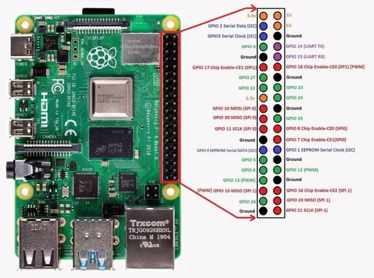

DHT22 / AM2302 Digital Humidity and Temperature Sensor Module
plugged into rasp pi 4 

PI prep work after fresh rasp os  
 
as root 
apt install python3-pip 
 
as user 
\curl -sSL https://get.initialstate.com/python -o - | sudo bash  
pip3 install adafruit-circuitpython-dht  
sudo apt-get install libgpiod2  

 
my config : 
on sensor 

vcc ~ white cable ~ 5v pin2 
data ~ red cable ~ pin 7 (gpio 4) 
grd ~ blue cable ~ pin 6 (on pi4 ran to pin 9) 

 
schematic 
